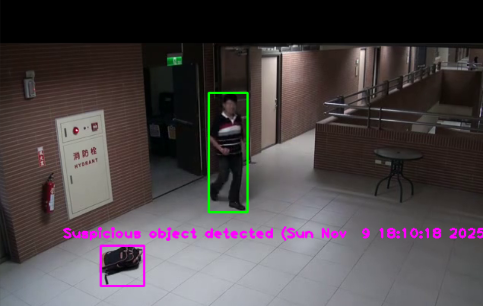

# Abandoned Object Detection

## Introduction
Automated video surveillance systems are widely used to monitor public and private spaces. In recent years, abandoned object detection has become an important research topic in security. The system identifies objects that remain in the same location for a long period, indicating they may be suspicious or abandoned.

This project compares a static background frame with real-time video frames. Any new stationary object detected for a long duration is considered abandoned.

---

## System Overview
The system works in two phases:

1. **Background Comparison**
   - Capture a static frame with no moving objects.
   - Compare the frame with continuous real-time video frames.

2. **Abandoned Object Detection**
   - If an object appears and stays at the same position for multiple frames, it is detected as abandoned.

---

## Implementation Details

### Tracker Program
- Tracks all detected objects and assigns unique IDs.
- Measures object movement and determines if an object becomes stationary for too long.
- Uses distance and frame count logic to determine abandoned state.

### Main Program
- Reads video frames using OpenCV.
- Converts frames to grayscale and applies Gaussian blur to remove noise.
- Detects objects using:
  - `cv2.absdiff`
  - `cv2.Canny
- Draws bounding boxes on abandoned objects and displays timestamp.
## Sample Output

Below is an example output of the system detecting an abandoned object:

